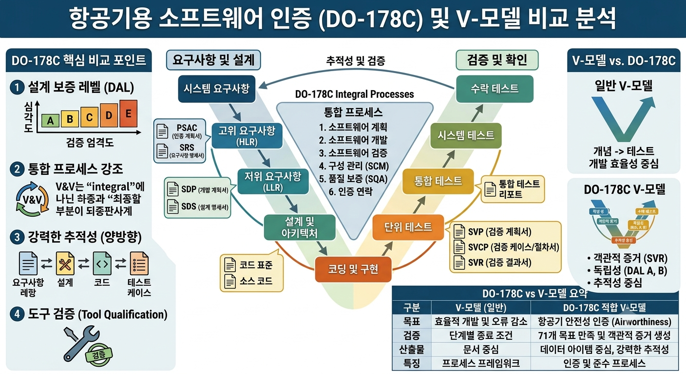

# 담당업무 및 V-모델 (V-Model) / DO-178C 개요

작성일: 2026-09-08

---



---

## 1. DO-178 (Software Considerations in Airborne Systems and Equipment Certification)

### 1.1 개요
DO-178은 **항공 탑재 시스템 및 장비 인증을 위한 소프트웨어 고려사항**을 규정한 표준으로,
RTCA(미국 항공무선기술위원회, Radio Technical Commission for Aeronautics)가 발행한다.

- **대응 유럽 표준**: ED-12 (EUROCAE)
- **적용 범위**: 항공기에 탑재되는 소프트웨어의 개발 프로세스 및 산출물 규정
- **목적**: 소프트웨어가 안전 필수(Safety-critical) 수준에서 신뢰성 있게 동작함을 입증하여 **항공기 감항인증(Airworthiness)** 획득 지원
- **특징**: V-모델 기반의 개발·검증 프로세스와 개발보증레벨(DAL)별 목표(Objectives) 체계를 규정
- 국내에서는 **KF-21, KUH 수리온 등 군용 항공기**를 포함한 항공 방산 개발에 표준적으로 적용

### 1.2 버전 변천사 (Version History)

#### DO-178 (1982) — 최초 버전
- 항공 전자 소프트웨어 품질 보증에 대한 최초의 체계적 표준
- FAA의 "Software Integrity Levels" 개념 초기화
- 소프트웨어 개발이 아닌 **소프트웨어 검증(Verification)** 중심의 지침
- 항공 산업계의 소프트웨어 안전·품질 문서화 필요성에 대한 최초의 공식 답변

#### DO-178A (1985) — 개정 1판
- **소프트웨어 레벨(Software Level)** 개념을 도입하고 레벨별 프로세스 강도를 차등화
- 심각도(Criticality)에 따른 3단계 레벨 체계 마련
- 개발 프로세스 전반(이동/계획/설계/구현/통합/검증)을 아우르는 점진적 확장
- 구조적 커버리지(Structural Coverage) 개념의 기초 도입
- 여전히 개발 문서화보다 **검증 활동**에 무게를 둠

#### DO-178B (1992) — 개정 2판
- 현재까지도 널리 알려진 **DO-178의 대표 버전**
- **5단계 개발보증레벨(DAL, Development Assurance Level) A~E** 체계 도입
  - Level A: 치명적(Catastrophic) — 고장 시 항공기 손실 가능
  - Level B: 위험(Hazardous)
  - Level C: 중대(Major)
  - Level D: 경미(Minor)
  - Level E: 무영향(No Effect)
- **목표(Objectives) 기반** 요구사항 체계로 전환 (표 A-1 ~ A-10 등)
- 소프트웨어 생명주기 프로세스의 산출물(Data) 및 추적성(Traceability) 요구 강화
- **독립성(Independence)** 요구사항 도입: DAL A/B 레벨에서는 검증 활동의 독립 수행 요구
- 구조적 커버리지(MC/DC 등) 요구사항 정식화
- 결함 예방(Fault Prevention), 결함 검출(Fault Detection) 개념 명문화
- 이후 **DO-178B가 국제적으로 사실상의 표준(de facto standard)**이 됨
- 인증 기반 기술(CAST, FAA Order 8110.49) 등 후속 지침의 기반이 됨
- 한계점: 기술 발전(모델기반개발, 객체지향, 정형기법, 도구 사용)을 충분히 반영하지 못함

#### DO-178C (2011) — 개정 3판 (현행 버전)
- **2011년 12월 발행**, DO-178B 공식 대체 (2012년 6월부터 적용)
- DO-178B의 철학과 구조를 계승하되, 20여 년간의 기술 변화를 반영한 전면 개정
- 주요 개정 특징:
  - **목표(Objectives)와 산출물(Data)** 중심의 구조 유지하면서 명확성 강화
  - **추적성(Traceability)** 요구사항 개념 확장·명문화
  - 소프트웨어 개발 프로세스의 **계획(Planning) 단계 중요성 강조**
  - 모델 기반 개발, 객체지향 기법, 정형기법(formal method)을 위한 보충 표준(Supplements) 신설
  - 도구 검증(Tool Qualification) 요구사항 명확화 (DO-330)
- **DO-178C 보충 문서(Supplements)** — 기술별 세부 지침 제공:
  - **DO-330**: 소프트웨어 도구 검증 고려사항 (Tool Qualification)
  - **DO-331**: 모델 기반 개발(MBD) 적용 지침
  - **DO-332**: 객체지향(OOT) 기술 적용 지침
  - **DO-333**: 정형기법(Formal Methods) 적용 지침
  - **DO-278A**: 지상 시스템 소프트웨어용 대응 표준

#### 버전 비교 요약

| 항목 | DO-178 (1982) | DO-178A (1985) | DO-178B (1992) | DO-178C (2011) |
|---|---|---|---|---|
| 소프트웨어 레벨 | 개념 초기화 | 3단계 도입 | **5단계(DAL A~E)** 도입 | 5단계 유지 |
| 접근 방식 | 검증 중심 | 프로세스 확장 | **목표(Objectives) 기반** | 목표 기반 유지·강화 |
| 추적성 요구 | 미약 | 일부 | 강화 | **체계적 명문화** |
| 구조적 커버리지 | 없음 | 기초 도입 | **정식화(MC/DC 등)** | 정식화 유지 |
| 독립성 요구 | 없음 | 없음 | DAL A/B에 도입 | 유지·강화 |
| 최신 기술 반영 | - | - | 부족 | **보충 문서로 해결** <br> (MBD/OOT/정형기법) |
| 도구 검증 | 없음 | 없음 | 일부 | **DO-330으로 명확화** |

### 1.3 DO-178C 핵심 구조

#### (1) 소프트웨어 생명주기 프로세스 (V-모델 기반)
- **계획(Planning) 전반**
  - 소프트웨어 계획 (PSAC: Plan for Software Aspects of Certification)
  - 소프트웨어 개발 계획, 검증 계획, 형상관리 계획, 품질보증 계획 등
- **개발 프로세스 (좌측, Top-down)**
  1. 시스템 요구사항 → 소프트웨어 요구사항 (System Requirements → Software Requirements)
  2. 소프트웨어 아키텍처 설계 (Software Architecture Design)
  3. 소프트웨어 상세 설계 (Software Detailed Design)
  4. 소프트웨어 코드 구현 (Software Coding)
  5. 소프트웨어 통합 (Software Integration)
- **검증 프로세스 (우측, Bottom-up)**
  1. 소프트웨어/시스템 하위레벨 요구사항 검증 (Requirements Verification)
  2. 아키텍처·상세 설계 검토 (Design Reviews)
  3. 소스코드 검토 (Code Reviews)
  4. 단위·통합 검증 (Unit/Integration Verification): 기반 요구사항 검증, 성능 검증, 강건성(Robustness) 검증
  5. 소프트웨어/하드웨어 통합 검증 (HW/SW Integration Verification)

#### (2) 개발보증레벨 (DAL) with 소프트웨어 레벨 결정
- 시스템 안전성 평가(ARP4754A, ARP4761)에 따라 **소프트웨어 레벨 A~E**를 할당
- 레벨에 따라 적용되는 목표 수·독립성 여부·커버리지 기준이 결정됨
- 예: Level A(치명)는 모든 목표가 독립적으로 검증되어야 하고, MC/DC 등 구조적 커버리지가 요구됨

#### (3) 구조적 커버리지 (Structural Coverage)
- **Statement Coverage** (조건문 수준)
- **Decision Coverage** (분기·판정 수준)
- **MC/DC (Modified Condition/Decision Coverage)** (Level A 필수) — 각 조건이 출력을 독립적으로 영향

#### (4) 산출물 (Data/Artifacts)
- 소프트웨어 요구사항 명세 → 설계 명세 → 소스 코드 → 실행 가능 객체
- 검증 결과(Test Case/Procedure/Result), 추적성 문서(요구사항-코드-시험 연계)
- 서비스 기록(Problem Reports), 형상 관리 기록, 품질보증 기록
- **인증자료(Certification Evidence)** 로서 SOI(Audit) 단계에서 평가

#### (5) 타 표준과의 관계
| 표준 | 범위 | 비고 |
|---|---|---|
| ARP4754A | 항공 **시스템** 개발 프로세스 | 시스템 레벨 V-모델, DO-178의 상위 |
| **DO-178C** | **소프트웨어** 개발 | 본 문서 주제 |
| DO-254 | **하드웨어**(전자부품) 개발 | Level A~E 동일 체계 |
| ARP4761 | 안전성 평가(SSA/FHA/PSSA) | DAL 결정 근거 제공 |
| D0-330~333 | DO-178C 보충 문서 | 도구/모델/OOT/정형기법 |
| DO-278A / DO-297 | 지상·통합모듈 소프트웨어 | 변형 적용 |

### 1.4 DO-178C 도입/이행 시 유의사항
- **DAL 산정이 모든 것의 출발점**: 시스템 안전성 평가 결과를 먼저 확정해야 함
- **추적성(Traceability)이 핵심**: 요구사항 ↔ 설계 ↔ 코드 ↔ 시험 4중 추적 필수
- **계획 문서를 먼저 승인** 받아야 개발 진행 가능 (PSAC 등)
- **독립성(Independence)**: DAL A/B는 검증·품질보증 활동의 독립 수행 필요
- **도구 사용 시 도구 검증(Tool Qualification)** 판단 필요 (DO-330)
- **형상관리/품질보증** 프로세스를 DO-178C 요구 수준으로 구축·유지

---

## 2. 디자인 리뷰 (Design Review): PDR, CDR 등

### 2.1 개요
- **디자인 리뷰(Design Review)** 는 개발 프로세스의 특정 마일스톤마다 **설계 산출물을 공식적으로 검토·심의하여 승인(Go/No-Go)** 하는 절차이다.
- V-모델의 하향식 설계 단계(요구사항 → 설계 → 구현)가 올바르게 진행되고 있는지, 후속 단계로 진행해도 되는지를 판단하는 **게이트(Gate)** 역할을 한다.
- 목적:
  - 설계 오류·요구사항 누락을 조기에 발견하여 후기 재작업 비용 감소
  - 설계 완성도와 구현 가능성(Maturity, Feasibility) 확인
  - 요구사항 대비 설계의 추적성(Traceability) 확인
  - 설계를 확정(Freeze)하고 기준선(Baseline)을 설정하여 형상 관리
  - 리스크 식별 및 완화 조치 확정
- 방산·항공 개발에서는 통상 최소 **SRR → PDR → CDR → TRR → FCA/PCA** 순으로 진행된다.

### 2.2 리뷰 유형 개관

| 리뷰 | 명칭 | 주요 시점 | 핵심 점검 내용 |
|---|---|---|---|
| SRR | System Requirements Review | 요구사항 수립 완료 시점 | 요구사항의 완전성·정확성·검증 가능성 |
| SDR | System Design Review | 시스템 설계 초기 | 시스템 아키텍처의 타당성 |
| PDR | Preliminary Design Review | 예비(개념) 설계 완료 시점 | 설계 방향·아키텍처·인터페이스 타당성 |
| CDR | Critical Design Review | 상세(최종) 설계 완료 시점 | 각 부품/모듈 레벨 설계의 세부 완성도 |
| TRR | Test Readiness Review | 시험 착수 전 | 시험 준비 상태(환경·절차·인원·측정) |
| FRR | Flight Readiness Review | 비행시험 전 (항공) | 비행 안전성·시험 준비 완료 |
| PRR | Production Readiness Review | 양산 착수 전 | 생산 설비·공정·품질 준비 상태 |
| FCA | Functional Configuration Audit | 시험·검증 종료 후 | 성능이 설계 요구사항을 충족하는지 |
| PCA | Physical Configuration Audit | 인도(양산) 전 | 실제 제작 산출물이 설계도면과 일치하는지 |
| Delivery/Acceptance | 인수검토 | 고객 인도 시점 | 인수 기준 충족 여부 |

> 항공 분야는 **ARP4754A**가 이 리뷰 체계를 규정하며, DO-178C의 SOI(인증 감사)와 연동된다.
> 미 국방부는 **DoD 5000 시리즈 / SE Guidebook**에서 유사한 기술 리뷰를 요구한다.

### 2.3 PDR (Preliminary Design Review, 예비설계 검토)

#### 정의 및 목적
- 예비설계(Preliminary Design, 개념/아키텍처 설계) 완료 후, **설계 방향이 요구사항을 충족하고 구현 가능한지**를 검증하고 다음 단계(상세설계) 진입을 승인하는 리뷰.

#### 주요 검토 항목
- 요구사항 대비 시스템/제품 아키텍처의 **추적성(Traceability)** 및 완전성
- 요구사항이 설계로 **모두 할당(Allocation)** 되었는지
- 기능·성능·인터페이스 정의의 타당성 (블록다이어그램, 인터페이스 제어문서 ICD)
- **리스크 식별(기술·일정·자원)** 및 완화 방안
- 예비 설계 기준선(Preliminary Baseline) 설정
- 구현·제작 가능성(제조, 조달, 소프트웨어) 검토
- 안전·신뢰성·유지보수성 등 특성 엔지니어링 검토

#### 산출물 (PDR 패키지)
- 예비 설계 문서(Preliminary Design Document)
- 아키텍처/블록 다이어그램, 인터페이스 정의
- 요구사항-설계 추적성 매트릭스
- 리스크 평가서, 양산·조달 전략 요약

#### 출구 기준 (Exit Criteria)
- 모든 미해결 항목(Action Item)이 종결되거나 후속 단계로 관리 가능한 수준으로 정리
- 요구사항과 설계 간 갭(Gap)이 없음
- 상세설계 착수 승인

### 2.4 CDR (Critical Design Review, 상세설계 검토)

#### 정의 및 목적
- **상세설계(Detailed Design)** 완료 후 수행하는 **최종 설계 검토**.
- 설계가 제작·구현·조립 가능한 수준으로 **최종 확정(Finalize)** 되었는지를 검증하고, 구현/제작 단계 진입을 승인하는 리뷰.

#### 주요 검토 항목
- **부품/모듈 레벨 상세 설계**의 완성도·정확성 (도면, 명세, 회로도, 소프트웨어 상세설계)
- 부품 간 **인터페이스 정의 완료** 및 인터페이스 통제
- 설계 기준(Design Baseline)의 **확정(Freeze)** 및 형상관리 설정
- 시험·검증 계획의 타당성 (시험 항목, 판정 기준, 커버리지)
- 생산·조립 절차와 툴링·지그의 설계 반영
- 유지보수·정비성(Maintainability), 안전성 분석 결과
- 잔여 리스크와 미해결 항목의 관리 방안
- 소프트웨어의 경우 **상세 설계↔코드 구현** 준비 상태, 구조적 커버리지 계획

#### 산출물 (CDR 패키지)
- 최종 설계 명세서(상세설계 문서), 제작 도면/명세
- 소프트웨어 상세설계 명세(개발 단위 수준)
- 시험 계획 초안, 예비 시험 절차
- 형상 관리 기준선 확정 문서
- 설계 및 인터페이스 추적성 최종본

#### 출구 기준 (Exit Criteria)
- 설계 기준선이 확정되고 변경 통제 대상으로 형상관리됨
- 모든 미결 설계 이슈가 종결(Close-out)됨
- 구현·제작·시험 착수 승인 (No outstanding critical items)

> **PDR vs CDR 정리**: PDR은 "무엇을 만들 것인가"의 설계 방향을 확정하는 단계,
> CDR은 "그것을 어떻게 정확히 만들 것인가"의 세부 설계를 확정하는 단계로 볼 수 있다.

### 2.5 리뷰 수행 절차 (일반적)

1. **준비(Preparation)**
   - 리뷰 패키지(설계 문서, 추적성 매트릭스, 시험 계획 등) 작성·배포
   - 리뷰 일정·참석자·역할(Role) 확정, 리뷰 자료 사전 검토(주석) 요청
2. **사전 검토(Pre-review)**
   - 참석자들이 패키지를 검토하고 질문·의견(Action Item) 사전 등록
   - 주요 쟁점 사전 취합 → 리뷰 회의 안건 구성
3. **리뷰 회의(Review Meeting)**
   - 설계 프레젠테이션, 쟁점 토론
   - 미해결 항목(Action Item) 목록 확정 및 담당자·기한 지정
   - **합의(Consensus)** 또는 투표로 Go/No-Go 결정
4. **조치(Follow-up)**
   - 등록된 Action Item별 해결·검증·문서 반영
   - 필요 시 재검토(Re-review) 또는 부분 승인(Concur with conditions)
5. **종결(Close-out)**
   - 모든 Action Item 종결 확인 → 리뷰 완료 보고서(Review Report) 발행
   - 설계 기준선 확정(또는 갱신) 및 형상관리 등록

### 2.6 리뷰의 마무리(Close-out)와 형상 관리
- 리뷰 완료의 핵심은 **미결 사항을 남기지 않는 것**이다.
  - Critical(중대) 항목: 리뷰 승인 전 반드시 해결
  - Non-critical 항목: 명시적 기한·담당자를 두고 후속 추적, 종결 전에는 후속 단계 잠정 진행 가능
- 리뷰 결과가 **승인(Approved / Concurred)** 일 때 비로소 설계 기준선(Baseline)이 확정되며,
  이후 설계 변경은 **형상 변경 관리(Configuration Change Control)** 절차를 통해서만 반영된다.
- 승인 결정은 **Review Report / Minutes**로 기록·배포하고 산출물과 함께 보존한다.

### 2.7 디자인 리뷰와 DO-178C / V-모델의 연계
- DO-178C에서는 시스템/소프트웨어 계획(PSAC 등) 시 **리뷰 프레임워크(전이 기준, 전이 판정 기준)** 를 정의하도록 요구한다.
- 소프트웨어 요구사항 → 아키텍처 → 상세설계 각 단계의 **검토(Review) 활동이 곧 V-모델 우측의 검증 활동**이며,
  설계 확정은 후속 단계(구현, 통합, 검증) 진입의 게이트가 된다.
- 항공기 인증의 경우, PDR/CDR과 별도로 **FAA/EASA의 SOI(Stage of Involvement) 감사**가 단계별로 진행된다.
  - SOI#1: 계획 리뷰 (Planning Review)
  - SOI#2: 개발 산출물 리뷰 (Development Review) — 설계 산출물 검토
  - SOI#3: 검증 활동 리뷰 (Verification Review)
  - SOI#4: 인증자료 검토 (Final Certification Review)

### 2.8 업무와 디자인 리뷰의 연관성
| 담당업무 | 디자인 리뷰 요소 |
|---|---|
| (a) 일정·현황 감독 | PDR/CDR 등 리뷰 마일스톤 일정 관리·진행 감독 |
| (b) 요구사항·설계명세 수립·검증·유지 | 리뷰에 제출할 설계 산출물(명세서) 작성·관리 |
| (d) 기술 보고서 작성 | 리뷰 패키지, Review Report, 조치 결과 보고서 작성 |
| (c) SME 협업 문제해결 | 리뷰에서 제기된 기술 이슈의 원인분석·해결 |
| (g) Test Case 검토 | CDR 이후 시험계획·시험항목의 타당성 검토와 연계 |

---

## 3. 담당업무

### (a) Supervise development schedule and status for each project
각 프로젝트의 개발 일정 및 진행 현황을 감독·관리한다.

- 프로젝트별 개발 일정(Schedule) 수립 및 마일스톤 관리
- 진행 현황(Status) 추적 및 리스크(지연, 이슈) 식별
- 일정 대비 실제 수행 실적 비교 및 지연 시 대응 조치
- 관련 이해관계자(개발팀, 품질팀, 고객) 간 커뮤니케이션

### (b) Establish, validate and maintain product requirements and design specifications
제품 요구사항과 설계 명세를 수립하고 검증하며 지속적으로 유지·관리한다.

- 고객 요구사항 수집·분석 → 요구사항 명세서(Requirements Specification) 수립
- 요구사항의 완전성(Completeness), 일관성(Consistency), 검증 가능성(Verifiability) 검토·검증
- 설계 명세서(Design Specification) 작성 및 요구사항과의 추적성(Traceability) 확보
- 형상 관리(Configuration Management)를 통한 변경 이력 관리 및 최신성 유지

### (c) Problem solving with SME(Subject Matter Experts)
전문가(SME)들과 함께 문제 해결 활동을 수행한다.

- 개발 중 발생하는 기술적 이슈·결함 분석
- 해당 분야 전문가(하드웨어, 소프트웨어, 시스템, 인증 등)와 협업하여 해결 방안 도출
- 근본 원인 분석(Root Cause Analysis) 및 시정·예방 조치(CAPA) 지원
- 솔루션의 타당성·영향도 검토 및 문서화

### (d) Write technical reports
기술 보고서를 작성한다.

- 개발 진행 보고서, 시험 결과 보고서, 분석 보고서 등 작성
- 요구사항 충족 여부, 시험 결과, 결함 현황, 잔여 리스크 등 체계적 기록
- 고객·관리자·인증기관 등 독자를 고려한 객관적·가독성 있는 문서화

### (e) Support product promotion and domestic/global sales activities
제품 홍보 및 국내·해외 영업 활동을 지원한다.

- 제품 기술 자료, 데이터시트, 소개자료 작성 지원
- 고객 대상 기술 설명회·입찰(Bid) 기술 제안서 작성 지원
- 해외 인증·표준 요구사항 파악 및 대응 지원

### (f) Analyze use cases
사용 사례(Use Case)를 분석한다.

- 시스템·제품이 어떤 상황에서 어떻게 사용되는지 시나리오 분석
- 사용자(고객) 관점의 기능 요구사항 도출 및 검증 기준 마련
- Use Case를 기반으로 요구사항, 설계, 시험(테스트) 연계

### (g) Review test cases
시험 항목(Test Case)을 검토한다.

- 요구사항 대비 시험 커버리지(Coverage) 검토
- 시험 절차, 기대 결과(Expected Result), 판정 기준(Pass/Fail)의 타당성 확인
- 누락·오류 시험 케이스 식별 및 개선 요청

---

## 4. V-모델 (V-Model) 전반

### 4.1 정의
V-모델은 **시스템 및 소프트웨어 개발 생명주기(Lifecycle) 모델**이다.
좌측(아래로)은 **요구사항 수립 → 설계 → 구현**의 하향식(Top-down) 단계이고,
우측(위로)은 **단위시험 → 통합시험 → 시스템 시험 → 인수시험**의 상향식(Bottom-up) 검증 단계로,
좌·우가 **V자 형태**로 대칭된다.

### 4.2 핵심 개념
- 각 개발 단계(좌측)에 **대응하는 검증 단계(우측)**가 항상 존재한다.
- 좌측 단계에서 수립된 문서(요구사항, 설계명세)가 곧 **우측 검증의 기준**이 된다.
- 이를 통해 **요구사항 → 검증 추적성(Traceability)**을 보장한다.
- 초기에 결함을 조기에 발견하여 후기 단계의 재작업 비용을 줄인다.

### 4.3 V-모델 단계 및 대응 관계

```
요구사항 분석 ─────────────── 인수시험(고객)     ← 사용자가 제대로 되었나?
  │ 설계(시스템) ─────────── 시스템 시험          ← 요구사항 대비 검증
    │ 설계(상세/부품) ────── 통합시험              ← 부품 간 결합 검증
      │  구현(코딩/제작) ── 단위시험                ← 개별 부품 검증
              ▼
```

| 단계 | 주요 활동 | 대응 검증 | 검증 내용 |
|---|---|---|---|
| 요구사항 분석 | 사용자 요구사항 수집·분석 | 인수시험 (UAT) | 고객이 요구한 대로 동작하는지 |
| 시스템 설계 | 시스템 아키텍처·통합 설계 | 시스템 시험 | 전체 시스템 요구사항 충족 여부 |
| 상세 설계 | 모듈·부품 단위 상세 설계 | 통합시험 | 모듈 간 연동·인터페이스 검증 |
| 구현 | 코딩, 하드웨어 제작 | 단위시험 | 개별 모듈의 기능·논리 검증 |

> **DO-178C와의 연계**: DO-178C의 소프트웨어 생명주기(요구사항 → 아키텍처 → 상세설계 → 구현 → 통합)와
> 우측 검증(요구사항/설계/코드 검토, 단위·통합 검증)은 이 V-모델의 좌·우 대칭 구조를 그대로 따른다.

### 4.4 Verification(검증) vs Validation(확인)
- **Verification (검증)**: "시스템을 처음부터 제대로 만들었는가?" → 설계 명세·요구사항 대비
  - 예: 단위시험, 통합시험, 시스템 시험, 코드 리뷰, 정적 분석
- **Validation (확인)**: "제대로 된 시스템을 만들었는가?" → 고객·사용자 요구 대비
  - 예: 인수시험(UAT), 실제 운용 환경 평가

> 두 개념은 다른 의미로, V-모델의 양 축(하향 설계/상향 검증)과 함께 고객 만족(Validation)을 최종 목표로 한다.
> DO-178C에서도 요구사항 검증(Verification)과 고객 요구 충족 확인(Validation)을 구분하여 다룬다.

### 4.5 V-모델의 장점
- 각 단계별 검증이 명확히 정의되어 **품질 보증(QA)에 강점**
- 요구사항 누락과 설계 오류를 조기 발견 (비용 절감)
- 산출물(문서) 기반의 **추적성 관리 용이** → 인증(DO-178C 등)에 적합
- 대규모·안전필수(Safety-critical) 시스템 개발에 적합

### 4.6 V-모델의 단점
- 단계가 정형화·문서화 중심이라 **변경에 대한 유연성이 낮음**
- 초기 요구사항이 명확해야 효과적 (불확실성이 높은 신규 개발에는 부적합)
- **반복(Iterative) 개발·애자일(Agile) 방식과 상충**
- 문서 작성에 많은 시간·비용 소요

### 4.7 적용 분야 및 관련 표준
- **항공 분야**: DO-178C (소프트웨어), ARP4754A (시스템), DO-254 (하드웨어)
- **방산 분야**: AQAP-2110 (NATO 품질보증), MIL-STD-499B / ANSI/EIA-632 (시스템 공학)
- **자동차 분야**: ISO 26262 (기능안전), Automotive SPICE
- **의료기기**: ISO 13485, IEC 62304 (의료 소프트웨어)
- **독일 정부**: V-Modell XT (연방 행정·방위 프로젝트)

### 4.8 업무와 V-모델의 연관성
| 담당업무 | V-모델 요소 |
|---|---|
| (b) 요구사항 수립·검증·유지 | 요구사항 분석 + 우측 검증 기준 수립 |
| (f) Use Case 분석 | 요구사항 분석(Validation) 활동 |
| (g) Test Case 검토 | 우측 검증 단계(단위·통합·시스템·인수시험)의 품질 검토 |
| (d) 기술 보고서 작성 | 각 단계 산출물(문서화) 활동 |
| (c) SME 협업 문제해결 | 단계 간 피드백·결함 해결 활동 |
| (a) 일정·현황 감독 | V-단계별 마일스톤·일정 관리 |

---

# DO-178C 및 V-모델 개발·검증 환경 가이드

본 문서는 항공기용 소프트웨어 인증 표준인 **DO-178C** 및 **V-모델(V-Model)** 프로세스를 준수하기 위해 요구사항 정의, 설계, 구현, 검증 및 확인(V&V) 단계에서 대표적으로 활용되는 주요 개발 도구 및 환경을 정리한 가이드입니다.

---

## 1. 요구사항 및 설계 (Requirements & Design) 환경

이 단계에서는 시스템 요구사항 분석, 고위 요구사항(HLR), 저위 요구사항(LLR), 소프트웨어 아키텍처 설계 및 양방향 추적성(Bi-directional Traceability) 관리가 핵심입니다.

### 1.1 IBM DOORS / DOORS Next Generation
* **주요 용도**: 요구사항 관리 및 추적성 수립 (ALM)
* **주요 특징**:
  * 항공/방산 분야의 사실상 표준(De-facto standard) 요구사항 관리 도구.
  * 요구사항의 버전 관리, 변경 이력 추적 및 승인 워크플로우 지원.
  * 고위 요구사항(HLR), 저위 요구사항(LLR), 소스 코드, 테스트 케이스 간의 양방향 추적성 매트릭스(Traceability Matrix) 생성.

### 1.2 Jama Connect
* **주요 용도**: 모던 웹 기반 요구사항 및 위험 관리
* **주요 특징**:
  * 웹 기반의 직관적인 UI로 실시간 협업 및 요구사항 리뷰 프로세스 간소화.
  * DO-178C 규격 준수를 위한 위험 평가(Risk Traceability) 및 영향도 분석(Impact Analysis) 지원.

### 1.3 Ansys SCADE Suite
* **주요 용도**: 모델 기반 개발(MBD) 및 자동 코드 생성 (DO-331 연계)
* **주요 특징**:
  * 안전 필수(Safety-Critical) 임베디드 소프트웨어를 위한 제어 로직 및 아키텍처 모델링 환경.
  * DAL A 등급까지 인증된 KCG 자동 코드 생성기를 포함하여, 설계 모델로부터 DO-178C 준수 C/Ada 코드를 직접 생성.

### 1.4 MathWorks MATLAB / Simulink
* **주요 용도**: 모델 기반 설계 및 시뮬레이션
* **주요 특징**:
  * 제어 알고리즘 시뮬레이션 및 시스템 수준 검증.
  * *Simulink Report Generator*, *Embedded Coder*, *Polyspace* 등과의 연동을 통해 요구사항 연결성 및 모델 수준 테스트 수행.

---

## 2. 검증 및 확인 (Verification & Validation) 환경

DO-178C에서는 동적 테스트(단위/통합/시스템 테스트), 정적 분석(Static Analysis), 구조적 커버리지 분석(Structural Coverage Analysis) 및 도구 자격 인증(Tool Qualification, DO-330) 지원 여부가 검증 환경 선정의 핵심 기준입니다.

### 2.1 동적 테스트 & 커버리지 분석 도구 (Dynamic Testing)

#### A. VectorCAST (VectorCAST/C++, VectorCAST/Ada)
* **주요 용도**: 자동화 단위(Unit) / 통합(Integration) 테스트 및 커버리지 분석
* **주요 특징**:
  * 타깃(Target) 보드 또는 시뮬레이터 환경 상에서의 자동화된 요구사항 기반 테스트 수행.
  * DAL A 등급 필수 요구사항인 **MC/DC (Modified Condition/Decision Coverage)**, Statement, Decision 커버리지 측정.
  * DO-330 기반 Tool Qualification Package(TQP) 제공.

#### B. LDRA Tool Suite (LDRA Testbed / Cantata)
* **주요 용도**: 정적/동적 검증 및 결합도 분석
* **주요 특징**:
  * 소스 코드 분석, 유닛 테스트, MC/DC 커버리지 분석 통합 환경 제공.
  * 데이터 결합(Data Coupling) 및 제어 결합(Control Coupling) 분석 기능을 통해 아키텍처 수준 검증 지원.

#### C. Rapita Verification Suite (RapiTest / RapiCover / RapiTime)
* **주요 용도**: 타깃 기반 동적 테스트 및 최장 실행 시간(WCET) 분석
* **주요 특징**:
  * 실제 타깃 환경에서 최저 오버헤드로 실시간 동적 테스트 및 커버리지 측정.
  * 최장 실행 시간(Worst-Case Execution Time, WCET) 분석을 통한 실시간 성능 타당성 검증.

### 2.2 정적 분석 도구 (Static Analysis & Formal Methods)

#### A. MathWorks Polyspace (Polyspace Bug Finder / Code Prover)
* **주요 용도**: 소스 코드 정적 분석 및 형식 검증(DO-333 연계)
* **주요 특징**:
  * 수학적 형식 검증 기법을 활용하여 런타임 에러(0으로 나누기, 배열 오버플로우, 널 포인터 참조 등)를 완벽히 탐지/증명.
  * 코드를 직접 실행하지 않고도 동적 테스트의 범위와 부담을 대폭 감소.

#### B. CodeSecure CodeSonar / Synopsys Coverity
* **주요 용도**: 정적 코드 분석 및 코딩 표준 준수 검사
* **주요 특징**:
  * MISRA C/C++, CERT C 등 보안 및 안전성 관련 코딩 표준 준수 여부 검사.
  * 메모리 누수, 동시성 오류, 데드락 등의 심각한 결함을 컴파일 단계에서 검출.

---

## 3. DO-178C 라이프사이클 단계별 도구 체인 요약

| 라이프사이클 단계 | 대표적 개발/검증 환경 (Toolchain) | DO-178C 주요 산출물 및 목표 |
| :--- | :--- | :--- |
| **요구사항 정의** | IBM DOORS, Jama Connect | SRS, HLR / LLR, 양방향 추적성 매트릭스 |
| **설계 및 코딩** | Ansys SCADE, MATLAB/Simulink,<br> Green Hills MULTI, Wind River VxWorks | SDS, 소스 코드, 모델 검증 리포트 |
| **정적 검증** | MathWorks Polyspace, LDRA Testbed,<br> CodeSonar | 정적 분석 보고서, MISRA 코딩 표준 준수 보고서 |
| **동적 검증 & 커버리지** | VectorCAST, LDRA,<br> Rapita Verification Suite | SVP, SVCP, SVR (Statement, Decision, MC/DC 커버리지 리포트) |

